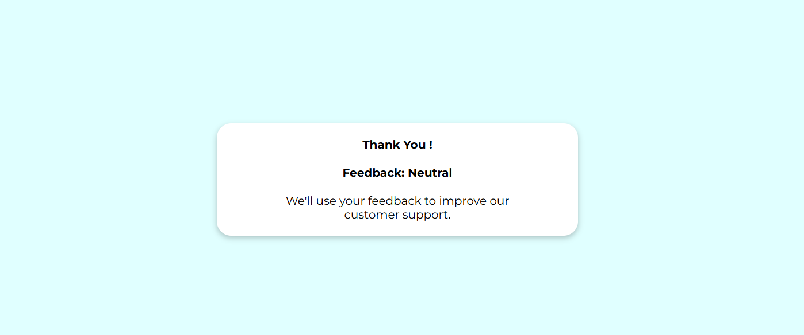

# Feedback UI  

## **Overview**  
The Feedback UI is a clean, interactive, and user-friendly interface for collecting user feedback. It provides emoji-based sentiment options, a text area for additional comments, and displays submitted feedback dynamically. The design is fully responsive and includes interactive hover and click effects for an enhanced user experience.  

---

## **Features**  
- **Emoji-Based Feedback**: Users can express their sentiment (Unhappy, Neutral, Satisfied) through intuitive emoji options.  
- **Additional Comments**: A text area for users to share detailed thoughts or suggestions.  
- **Dynamic Feedback Display**: Submitted feedback is dynamically displayed with a thank-you message.  
- **Responsive Design**: Fully responsive and adapts to various devices and screen sizes.  
- **Interactive Styling**: Includes hover effects, focus highlights, and smooth color transitions.  

---

## **Technologies Used**  
- **HTML5**: Markup structure.  
- **CSS3**: Styling and layout.  
- **JavaScript**: Dynamic functionality and event handling.  

---

## **Live Demo**
Experience the live version of the application: [Feedback-UI](https://naveen-kumarj.github.io/Feedback-UI/) 🚀

## **Project Screenshots**



## **File Structure**
```
feedback-ui/
│
├── index.html        # Main HTML file
├── styles.css        # Styling for the application
├── index.js          # JavaScript for interactivity
├── assets/           # Contains images and icons
│   ├── unhappy-emoji.svg
│   ├── neutral-emoji.svg
│   ├── happy-emoji.svg
├── screenshots/      # Screenshots for README
│   ├── feedback-form.png
│   ├── submitted-feedback.png
└── README.md         # Project documentation
```
---
Happy Coding! 🚀
